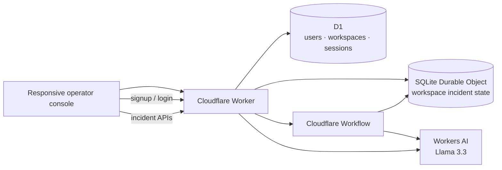

# IncidentOps AI

**Cloudflare-native infrastructure incident intelligence.**

**Live demo:** `https://opsagent.yaswanthkadhati.workers.dev`

IncidentOps AI turns a focused incident report and log excerpt into a durable, auditable triage workflow. It was built for Cloudflare's optional Software Engineer assignment and intentionally demonstrates an LLM, durable coordination, user input, and persistent memory/state using Cloudflare-native primitives.

> IncidentOps is an engineering demo, not an autonomous production operator. It never executes infrastructure changes. Remediation remains human-reviewed.

## Assignment coverage

| Requested component | IncidentOps implementation |
| --- | --- |
| LLM | Workers AI — `@cf/meta/llama-3.3-70b-instruct-fp8-fast` |
| Workflow / coordination | Cloudflare Workflows with replay-safe steps, retries, timeout, and deterministic fallback |
| User input | Responsive incident console + incident-scoped Copilot |
| Memory / state | SQLite-backed Durable Object per workspace |
| Account persistence | Cloudflare D1 for users, workspace ownership, sessions, and auth rate-limit state |
| AI-assisted coding history | [`docs/PROMPT_HISTORY.md`](docs/PROMPT_HISTORY.md) |

## Two deliberate access modes

A reviewer should be able to use the application immediately, so **no account is required**.

### Reviewer demo mode

The Worker issues a random workspace UUID. The browser places it in `#w=<uuid>` and sends it in an `x-workspace-id` header. The UUID maps to one SQLite-backed Durable Object. Sharing the full URL opens the same durable incident state on another device.

The demo workspace URL is a bearer-style capability, not user authentication.

### Account mode

A user can create an account from the demo. Signup **claims the current demo workspace**, so existing incidents are not thrown away. D1 stores account/session metadata and maps the authenticated user back to the same Durable Object workspace.

After that:

```text
Laptop signup / sign in
        │
        ├── D1 → user + session + workspace membership
        │
        └── Durable Object → incidents + timeline + Copilot history
                                      ▲
                                      │
Phone sign in ────────────────────────┘
```

The same account therefore retrieves the same workspace on desktop, mobile, a private window, or after browser storage is cleared.

## What it does

An operator creates an incident with a service, environment, impact description, and an optional focused log excerpt. The Worker validates and redacts the payload before persistence, saves the incident in a workspace Durable Object, and starts a Cloudflare Workflow.

The Workflow then:

1. loads the persisted incident;
2. extracts deterministic operational signals (5xx, timeouts, database pressure, throttling, DNS/TLS, deployments, and more);
3. correlates the incident against resolved incidents in the same workspace;
4. requests a schema-constrained assessment from Workers AI;
5. independently bounds and normalizes model output;
6. falls back to conservative deterministic triage if inference fails after retries; and
7. persists the final assessment and audit timeline.

The UI surfaces severity, confidence, category, evidence, likely cause, prioritized actions, verification steps, rollback/escalation criteria, timeline events, incident memory, JSON export, and durable incident-scoped Copilot chat.

## Architecture



The split is intentional:

- **D1** is the shared account/index database: users, workspace ownership, memberships, sessions, and auth throttling.
- **Durable Object SQLite** is the workspace-local operational state: incidents, timelines, Copilot messages, related-incident memory, and per-workspace quotas.

This avoids using D1 merely as a checkbox while preserving the strongest reason to use Durable Objects: colocated, serialized state for an individual workspace.

See [`docs/ARCHITECTURE.md`](docs/ARCHITECTURE.md) for the full trust and failure model.

## Authentication design

Authentication is implemented without an external identity provider or paid service:

- passwords are derived with **PBKDF2-SHA256** using a unique random salt;
- only the derived hash and salt are stored;
- login uses a generic invalid-credentials response;
- session tokens are random, but **only SHA-256 hashes of session tokens are stored in D1**;
- production cookies are `HttpOnly`, `Secure`, `SameSite=Lax`, and scoped to `/`;
- sessions expire after seven days and old sessions are bounded;
- login/signup attempts are rate-limited using D1-backed hashed buckets;
- every account workspace request is authorization-checked against D1 membership;
- a workspace that has been claimed by an account can no longer be accessed anonymously through its old demo link;
- state-changing requests reject cross-site browser mutations.

This is a focused assignment identity layer, not a full consumer identity product. Email verification, password reset, MFA, and organization invitation flows are intentionally out of scope because they require additional delivery/identity infrastructure and do not improve the assignment's core demonstration.

## Security and reliability choices

### Evidence before inference

Known incident signals are extracted deterministically before the LLM is called. The model receives normalized evidence rather than an unbounded transcript.

### Structured output + hard fallback

Workers AI is asked for a JSON-schema response. The result is still treated as untrusted: confidence is clamped, strings/arrays are bounded, categories are normalized, and secrets are redacted. If AI analysis fails, a deterministic fallback completes the incident instead of leaving it stuck.

### Durable orchestration

Workflow step names are deterministic and state required by later steps is returned/persisted. The AI step has bounded retries and exponential backoff. State transitions are visible in the timeline.

### Human-in-the-loop

There are no deployment, shell, cloud-control, or production mutation tools. IncidentOps proposes actions and verification/rollback criteria; only the IncidentOps record itself can be marked resolved.

### Input and browser hardening

Incident/chat input is server-validated, size-bounded, and secret-redacted. Static responses include CSP, clickjacking protection, referrer policy, restrictive permissions policy, COOP, and CORP headers.

See [`docs/SECURITY.md`](docs/SECURITY.md).

## Repository layout

```text
incidentops-ai/
├── worker/
│   ├── index.js          # Worker API, auth boundary, authorization, security headers
│   ├── auth.js           # D1 auth/session/password helpers
│   ├── workflow.js       # Durable multi-step investigation
│   ├── store.js          # SQLite Durable Object incident/chat/audit state
│   └── domain.js         # Validation, redaction, signals, fallback logic
├── migrations/
│   └── 0001_auth.sql     # D1 account/session schema
├── public/
│   ├── index.html
│   ├── app.js
│   ├── styles.css
│   └── favicon.svg
├── tests/
│   ├── auth.test.mjs
│   └── domain.test.mjs
├── scripts/
│   └── validate-structure.mjs
├── docs/
├── .github/workflows/ci.yml
├── wrangler.jsonc
└── package.json
```

The application has **no runtime npm dependency**. Cloudflare runtime primitives are used directly; Wrangler is invoked through `npx` for development/deployment.

## Local quality gate

Prerequisites: Node.js 22+, npm, and a Cloudflare account.

```bash
npm run check
```

This runs syntax validation, 14 unit tests, and repository structure/security assertions.

## Cloudflare bindings

No OpenAI, Anthropic, or other external API key is required.

`wrangler.jsonc` declares:

- `AI` — Workers AI;
- `INCIDENT_WORKFLOW` — Workflows;
- `INCIDENT_STORE` — SQLite-backed Durable Object;
- `AUTH_DB` — D1 account database; and
- `ASSETS` — static frontend assets.

The D1 binding intentionally omits an account-specific database ID in the template. Wrangler 4.135 can automatically provision the D1 resource during the first deployment and write its generated resource configuration locally.

## Deploy

Authenticate Wrangler first:

```bash
npx --yes wrangler@4.135.0 login
```

Then:

```bash
npm run deploy
```

The deploy script performs:

```text
quality gate
→ Worker deployment / D1 automatic provisioning
→ remote D1 migration application
```

On the first run, Wrangler may ask you to confirm the D1 migration. Approve it.

After deployment verify:

```text
https://opsagent.<your-subdomain>.workers.dev/api/health
```

Then test both access paths:

1. **Demo:** create an incident → share workspace URL → open it on another device.
2. **Account:** create/sign up from that demo → the existing incident remains → sign out → sign in on another device → the same incident is restored without the shared demo URL.

See [`docs/DEPLOYMENT.md`](docs/DEPLOYMENT.md) and [`docs/SUBMISSION_CHECKLIST.md`](docs/SUBMISSION_CHECKLIST.md).

## Free-plan intent

The default deployment uses Cloudflare Workers/Static Assets, Workers AI, Workflows, D1, and SQLite-backed Durable Objects. These products have free-plan allowances suitable for a small hiring demo, but quotas and model availability can change. The repository deliberately does not require a paid third-party API.

## Reviewer path

[`docs/REVIEWER_GUIDE.md`](docs/REVIEWER_GUIDE.md) provides a two-to-five-minute path covering demo mode, account persistence, durable workflow execution, incident memory, structured AI/fallback behavior, and the human safety boundary.

## AI-assisted development

AI-assisted coding was used, as the assignment explicitly permits. Material prompts/refinements are recorded in [`docs/PROMPT_HISTORY.md`](docs/PROMPT_HISTORY.md). Runtime prompts are committed directly in `worker/workflow.js` and `worker/index.js`.

## License

MIT
