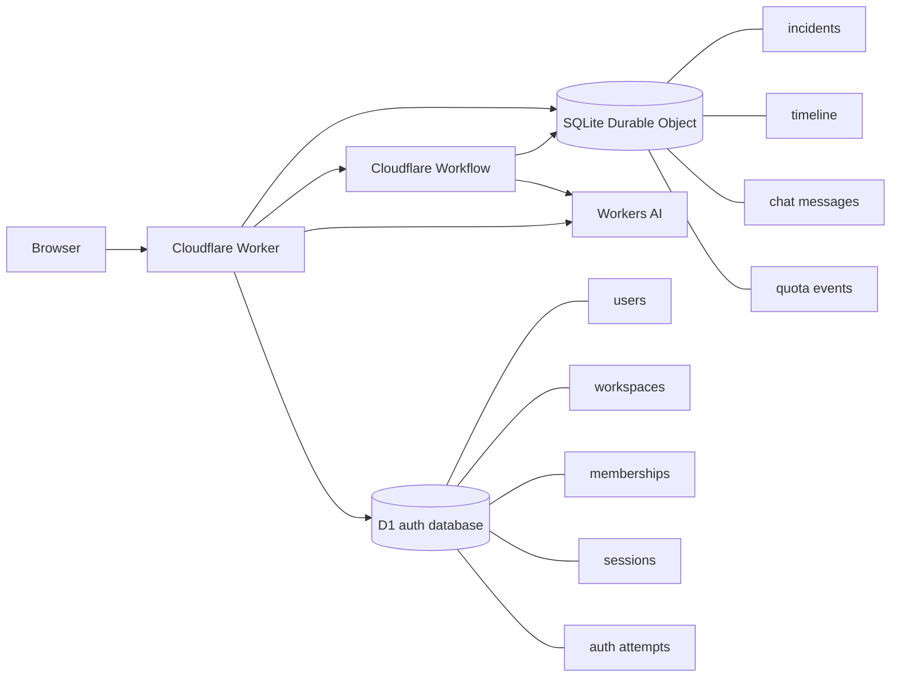
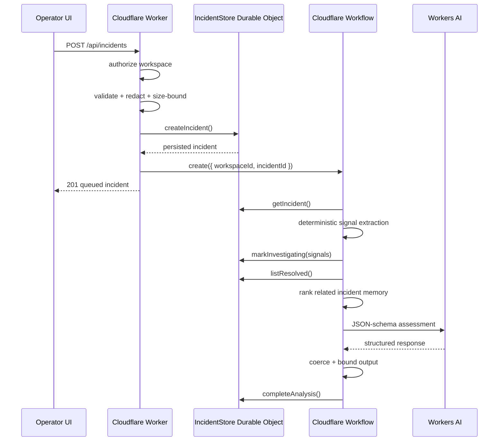

# Architecture

## Goal

IncidentOps AI is a compact, production-oriented incident triage system built from Cloudflare primitives. It is intentionally not a fake observability platform. The design demonstrates durable state, identity, deterministic evidence processing, LLM-assisted reasoning, and failure-aware orchestration while keeping the reviewer experience frictionless.

## System overview



## Why D1 and Durable Objects both exist

The two storage layers solve different problems.

### D1: global account/index data

D1 stores data that must be looked up across devices before the application knows which workspace Durable Object to address:

- users;
- password derivation metadata;
- workspaces;
- memberships;
- hashed sessions; and
- auth rate-limit buckets.

D1 is therefore the shared identity/index database.

### Durable Object SQLite: workspace operational state

Each workspace UUID maps to one `IncidentStore` Durable Object using `getByName(workspaceId)`. That object owns:

- incidents;
- deterministic and AI assessment state;
- timeline events;
- incident-scoped Copilot history;
- related resolved-incident memory; and
- per-workspace demo/usage quotas.

This keeps mutable incident state serialized and close to the workspace execution path instead of turning D1 into a generic catch-all database.

## Access modes

### Demo mode

A new anonymous visitor calls `POST /api/workspaces` and receives a random UUID. The browser places it into a URL fragment:

```text
#w=<workspace-uuid>
```

The fragment is not sent automatically in HTTP requests. The frontend reads it and sends the workspace ID in the same-origin `x-workspace-id` API header.

A demo workspace has no row in the D1 `workspaces` table. Possession of the full workspace link is the capability to access it.

### Account mode

On signup, the current demo workspace can be claimed. The Worker creates:

1. a `users` row;
2. a `workspaces` row using the existing demo workspace UUID;
3. an owner `memberships` row; and
4. a hashed session row.

Once a D1 workspace row exists, anonymous access to that workspace ID is denied. Only an authenticated D1 membership can reach its Durable Object.

On login from another device, the Worker resolves the session → user → workspace membership, then addresses the same Durable Object UUID. No browser-local pointer is required.

## Authentication request path

```mermaid
sequenceDiagram
  participant B as Browser
  participant W as Worker
  participant DB as D1
  participant DO as Durable Object

  B->>W: POST /api/auth/signup
  W->>W: validate input + rate limit
  W->>W: PBKDF2-SHA256(password, random salt)
  W->>DB: insert user + workspace + membership
  W->>DB: store SHA-256(session token)
  W-->>B: Set-Cookie: HttpOnly; Secure; SameSite=Lax

  B->>W: GET /api/bootstrap + cookie
  W->>DB: session lookup + workspace authorization
  W->>DO: listIncidents()
  DO-->>W: durable workspace state
  W-->>B: incidents + viewer context
```

The raw session token exists only in the cookie. D1 stores its SHA-256 digest.

## Incident request path



## Components

### Cloudflare Worker

`worker/index.js` is the network/trust boundary. It:

- serves the SPA through Static Assets;
- adds browser security headers;
- handles account endpoints;
- resolves authenticated or demo workspace access;
- rejects anonymous access to claimed account workspaces;
- rejects cross-site mutation requests;
- validates and bounds JSON bodies;
- validates/redacts incident and chat input;
- starts and inspects Workflows; and
- invokes the incident-scoped Copilot.

### Authentication module

`worker/auth.js` owns account security mechanics:

- normalized email/name/password validation;
- PBKDF2-SHA256 password derivation with per-user random salt;
- random session token issuance;
- SHA-256 session-token persistence;
- seven-day expiry;
- bounded active sessions;
- `HttpOnly` / `Secure` / `SameSite=Lax` cookies in HTTPS production;
- D1-backed login/signup throttling; and
- D1 membership authorization.

### D1 migrations

`migrations/0001_auth.sql` creates the account schema. D1 migrations are explicit and versioned rather than creating account tables lazily in request handlers.

### IncidentStore Durable Object

`worker/store.js` initializes its private SQLite schema idempotently and serializes workspace mutations.

Tables:

- `incidents`;
- `timeline`;
- `chat_messages`; and
- `quota_events`.

Incident history is bounded to the 200 most recently updated records and Copilot history to the latest 40 messages per incident.

### IncidentInvestigationWorkflow

The Workflow uses deterministic step names and persisted state.

Steps:

1. load incident;
2. extract deterministic signals;
3. correlate resolved incident memory;
4. request structured Workers AI assessment with bounded retries/timeout;
5. build deterministic fallback if needed;
6. record fallback details; and
7. persist final assessment.

### Workers AI

The configured model is `@cf/meta/llama-3.3-70b-instruct-fp8-fast`. JSON schema constrains the response shape, but model output remains untrusted and is normalized before persistence.

The Copilot uses a smaller context: current incident assessment + recent durable chat messages.

## Failure model

### Workers AI unavailable

The Workflow retries inference and then writes a conservative deterministic fallback. The incident remains usable and the timeline explains which path was taken.

### Workflow creation fails

The incident is already stored. Its state is marked `needs_attention` and the API returns an explicit warning.

### Copilot inference fails

The user message remains stored. A short response is generated from the persisted assessment and the fallback is recorded in the timeline.

### Browser disconnects

Operational state is server-owned. A refresh reloads from the Durable Object. Authenticated users can recover the workspace from D1 on any device by signing in.

### Demo site storage is cleared

If the full `#w=` link is retained, the same demo workspace remains reachable. If both the local pointer and link are lost, a new demo workspace is created because there is intentionally no anonymous identity recovery mechanism.

### Account cookie is cleared

The workspace does not disappear. Signing in again resolves it from D1 and reconnects to the same Durable Object.

## Trust boundaries

1. Browser input is untrusted and validated server-side.
2. Model output is untrusted and normalized before persistence.
3. Demo workspace links are bearer capabilities, not identities.
4. Claimed workspaces require D1 membership authorization.
5. Raw session tokens are never persisted; only their hashes are stored.
6. IncidentOps has no production infrastructure mutation capability.
7. Secret redaction is defense-in-depth, not permission to submit real credentials.

## Deliberate scope limits

This assignment identity layer does not include email verification, password reset, MFA, SSO, organization invites, audit export to an external SIEM, or infrastructure-control credentials. Those features need additional identity/delivery integrations and would distract from the requested AI + workflow + state demonstration.
